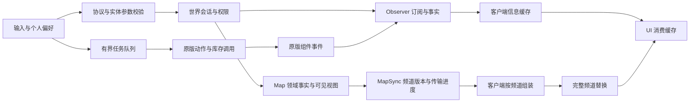

# 架构、性能与状态管理审查及优化

2026-09-14，Wildwise 0.3.0。审查基线为 `7618aba8c977da139475c074af078dbc03ea0318`，覆盖当时全部 33 个生产 Lua 文件、两个 Python 工具、工程配置、测试和关键引擎适配。后续根据“复杂度、数据流与状态管理尽可能优化”的要求实施本文件中的修改。

**现有分层可继续使用；本轮确认的 2 项 P1、6 项 P2 已修复。** 主要收益是约束热点的计算量、分离地图更新频率、明确会话与快照状态。新增两个内部模块分别承担有序索引和地图同步，未增加运行依赖。当前验证仍不覆盖真实远程多人、图形渲染及长期稳定性。

## 审查发现与处理

P1 为应优先解决的正确性／异常边界问题，P2 为具有明确触发条件的性能或恢复缺陷。每项均用实际内部模块组合复现，再补回归；不是仅依据代码风格提出的猜测。

| ID | 级别／维度 | 修改前的触发与影响 | 当前处理与回归 |
|---|---|---|---|
| R01 | P1，鲁棒性 | 合法 JSON 加数值 target 可在服务端抛类型异常；已有订阅时 nil unsubscribe 抛空索引异常 | 独立 RPC 实体参数先校验，`U.valid` 检查类型与方法，nil 取消订阅幂等；OPT-13 |
| R02 | P1，数据一致性 | 同一玩家 health→hover→health 把 diff 标成 snapshot；客户端清空旧表后丢失未变的血量字段，后续刷新不能恢复 | snapshot 发当前用途的完整字段，delta 才发差异；实际 Observer→Protocol→Client 往返，OPT-01 |
| R03 | P2，会话恢复 | HUD 重建的新 hello 复用 session、清零序号并保留旧地图基线；旧请求／动作回调可能影响新队列，静态地图不重发 | nonce 幂等重试，新 nonce 轮换 session 并清理会话所属资源；旧回调校验 session；OPT-14／15 |
| R04 | P2，输入性能 | 双击先对范围内全部实体做 O(N²) 路线排序，再筛同类与容量；200 项队列上限没有约束计算 | 先过滤和去重，有界堆选最近 K 项，再规划；坐标在规划内读取一次；OPT-04／05 |
| R05 | P2，服务端性能 | 2 ms 检查只在物品候选之间；一个候选构造、排序和遍历数千个不兼容堆，越过预算 | 来源序号 AVL 空间桶，九桶后继查询，64 次尝试上限与同一截止时间，标量游标跨 Tick 续作；OPT-06／07 |
| R06 | P2，数据流与传输 | 任一玩家移动导致每名接收者重编码全部静态配对，同次循环发完所有分片 | 四个独立频道、可见性缓存、共享正文编码、分 Tick 预检与发送、每频道完整提交；OPT-08～12／16／17 |
| R07 | P2，队列状态 | 当前任务结束后 wait_since 残留，下一任务几乎立即达到五秒超时 | 完成任务时释放所属等待状态，并减少正常结果路径的重复预留释放；OPT-03 |
| R08 | P2，常态性能 | health 订阅 next_dynamic 一直为 0，无变化仍每 100 ms 复制字段、过滤、排序 schema | 健康事件／500 ms 刷新／显式重试驱动；两字段健康路径、一次排序 schema；失败后恢复原值也退出重试；OPT-02／18 |

实施位置：`core/protocol.lua`、`core/ordered_index.lua`、`services/observer.lua`、`services/items.lua`、`services/planner.lua`、`services/map.lua`、`services/map_sync.lua`、`services/queue.lua`、`runtime/client.lua`、`runtime/input.lua` 和世界协调组件。18 项新增测试位于 `tests/optimization_spec.lua`。

## 架构与扩展性判断

`core → services → runtime/UI` 的职责划分成立。服务层决定权限、物品来源、事实与队列规则；runtime 解释原版事件并执行原生动作；UI 消费客户端缓存。服务端事实、客户端个人设置和持久地图数据已有不同归属。`Lifetime` 与 hook 释放机制、原版 Get／Put／GiveItem 路径、事务式存档验证值得保留。

主要结构问题在协调边界：世界组件同时决定地图内容、序列化、分片和同步发送；会话重建没有同步重建各子系统状态。此次把传输工作放入 `map_sync`，世界组件只发布当前可见频道和接收者。`map` 持有领域事实，`map_sync` 持有临时传输进度，客户端只提交完整频道，三者不共同修改同一份业务记录。

物品服务增加 AVL，代码量会增加，但复杂度集中于仅提供 set／remove／after 的内部索引。它消除了每个候选展开整个邻居集合的开销，并使删除／重新索引期间的跨 Tick 游标仍有效。索引由实体生命周期清理，空间为 O(已索引实体数)。没有用永久跳过未完成物品来降低耗时。

扩展继续沿用明确的内部模块入口：新字段登记 schema、读取归属和 formatter；新动作适配原版选择器与有界队列；新地图频道需要同时声明同步键、接收契约和完成策略。当前 schema 在模块初始化时完成注册，不支持运行期任意增删字段。新索引与同步器均为内部模块，不承诺稳定的外部插件接口。

## 数据流与状态归属

| 状态 | 唯一管理者 | 推进条件 | 失效与释放 |
|---|---|---|---|
| session／入站 seq／动作观察 | 世界组件的玩家 state | 新 nonce 建立新会话；同 nonce 重试不回拨 | 重建或退服释放观察与预留；旧 session 回调不能发结果 |
| 公共事实与个人查看字段 | Observer 的实体 record／个人 sub | 公共 500 ms、healthdelta、用途变化、发送重试 | 订阅过期、权限变化、实体移除、会话替换 |
| 已发送字段基线 | `sub.previous` | 成功提交 snapshot／delta 后推进 | 失败保留；恢复原值时清除 retry |
| 个人显示设置 | Client.settings | 原生持久偏好加载或用户修改 | 与服务器规则分离；共享许可由当前世界下发 |
| 配对／发现／探索来源 | Map | 领域事件修改 revision，记录替换保持快照稳定 | 验证后整体载入；损坏存档保留原数据 |
| desired／active／applied | MapSync 的玩家频道 state | 新版本排队；当前包成功提交后前进 | 权限／版本切换取消旧流；退服、超时、会话替换清理 |
| 不完整地图与可显示地图 | Client.map_pending／Client.map | begin→连续 chunk→合法 end 后替换对应频道 | 重片／缺片丢弃待组装版本，保留原完整频道 |
| generation／inflight／wait_since | Queue | 单个当前任务推进 | 完成清等待起点；暂停／取消作废回调 |
| 空间索引与合并游标 | Items | 按来源序号查找较早合法堆；预算内转移 | 实体移除、入包、来源重标记清理；未完成续排 |

`applied` 表示本机已成功提交全部消息给传输层，并非远端确认；本轮没有新增应用层 ACK。会话与频道的原子边界不同：多个频道可在不同 Tick 提交，单个频道内部不会显示半成品。共享撤销会停止未发完的旧频道并发布新可见内容，无法让接收者忘记此前已合法收到的信息。

## 复杂度与预算变化

N 为输入候选或空间桶规模，K 为剩余任务容量且 K≤200；P 为活跃接收者数，W 为可见配对数，C 为单个同权限视图需要的分片数。

| 路径 | 修改前 | 修改后 | 保留的成本 |
|---|---|---|---|
| 路线规划 | O(N²)，反复读坐标 | O(N log K + K²)，规划内存 O(K) | FindEntities 返回数组 O(N)，动作资格检查仍需逐候选执行 |
| 单物品邻居 | 展开 O(N)＋排序 O(N log N)＋全部尝试 | 桶操作 O(log N)，每次最多 64 个九桶后继＋2 ms 截止检查 | 扫完不兼容邻居仍需要总工作量；分摊到后续 Tick |
| 稳态配对视图 | 每玩家每次重建、排序、JSON 对比 | revision／权限不变时缓存命中 O(1) | 初次或配对版本变化时仍需 O(W log W) 生成视图 |
| 单次位置变化 | 每接收者重做含 W 项配对的整图编码与同步发送 | 仅位置频道变化；同视图正文编码共享 | 发送到 P 名玩家仍需 P 份载荷；网络量随实际玩家数据增长 |
| 大频道首次同步 | 一次准备并发送所有分片 | 预检目标 1 ms，最多 32 步；总目标 2 ms，最多 8 包／24,000 字节每 Tick | 同权限正文 O(C) 编码，实际投递仍 O(P×C)，初始等待增加 |
| 无变化 health 订阅 | 每 Tick 字段拷贝／全 schema 整理 | 跳过字段路径；事件、重试与 500 ms 轮询仍生效 | 权限和租期检查仍执行，不能把它当零 CPU |

上述 2 ms 分别属于物品服务和地图同步器，不是整个世界组件的统一预算。单个原生 Get／Put／RPC 或 JSON 编码不能中途抢占。高密度场景中最终耗时应以实际引擎测量为准。

## 修改前后隔离探针

同一机器、Lua 5.1，使用实际服务／协调模块；实体、时钟入口和发送端为测试替身，地图编码使用与安装引擎字节一致的原版 JSON。CPU 为单轮观测，不能解释为游戏帧率或稳定 p95。原始数据见 [optimization-results.txt](evidence/optimization-results.txt)。

| 场景 | 修改前 | 修改后 |
|---|---|---|
| 5,000 候选规划 | 12,507,500 次坐标读取，约 3,797 ms | 5,000 次；最多选择 200 项，约 11.6 ms |
| 1,000 个拒绝合并的旧堆 | 一个候选约 9.0 ms，同次扫描完 | 首 Tick 约 1.4 ms，16 Tick 完成；全部 1,000 次尝试完成 |
| 5,000 个拒绝合并的旧堆 | 一个候选约 52.9 ms，同次扫描完 | 首 Tick 约 1.2 ms，79 Tick 完成；全部 5,000 次尝试完成 |
| 6 个接收者、200 对虫洞、仅位置移动 | 120 包／172,590 字节 | 6 包／3,216 字节 |
| 6 个接收者、2,048 对虫洞、仅位置移动 | 1,044 包／1,785,588 字节 | 6 包／3,222 字节 |
| 120 个 health 订阅，100 次未到刷新点的调用 | 12,000 次 sanitize，平均约 7.86 ms／调用 | 0 次 filter，平均约 0.274 ms／调用 |

规划的工作定义有意变化：只为实际能进入队列的最近 200 项规划，不再计算随后被丢弃的完整路线。物品探针测的是每 Tick 峰值及最终完成，不能宣称总工作量减少为常数。地图先完成初始同步，再移动一单位；优化后计数包含 MapUpdate 和十次发送 Tick，优化前一次 MapUpdate 已同步发完全部消息。2,048 对为容量压力场景，不代表普通原版世界规模。健康探针固定在未达到 500 ms 刷新的时刻，只隔离空闲字段路径。

## 验证与剩余边界

- `npm run check`：139 项 Lua 回归、7 项 Python 采集器夹具；55 个 Lua 文件静态检查无警告／错误，格式和安装包 Lua 编译检查通过。
- 最终运行代码在重启后的官方专服 747465 / Steam build 24700372 上重跑 111 项原版／无画面合约：26 基础、34 前轮回归、9 原版回归、7 UI、8 标牌、1 主机夹具、17 能力、6 外观生命周期、3 异步落地，全通过。
- 新建独立离线 Master 测试世界；没有连接真实远程玩家。原版组件与 Widget 属实，皮肤资产入口有替身，无渲染画面。`Invalid RPC sender list` 来自假身份夹具；FROMNUM 不是图形验收。
- 100／500／1,000 件原版燧石负载探针各持续 20 秒，在异步用例结束后串行执行，核对守恒和清空。最终 Tick 分位数和样本量如下，完整记录见 [结构化证据](evidence/optimization-status.json)。它测量整个 Wildwise Tick CPU，不含实体生成、游戏整体逻辑帧、客户端帧率或实际网络开销。

| 原版燧石数 | Tick 样本 | p50 ms | p95 ms | p99 ms | 守恒／最终待处理 |
|---:|---:|---:|---:|---:|---|
| 100 | 200 | 0.024 | 0.155 | 2.108 | 是／0 |
| 500 | 201 | 0.030 | 2.112 | 2.178 | 是／0 |
| 1,000 | 199 | 0.050 | 2.142 | 2.234 | 是／0 |

仍需在目标环境执行已有 [人工回归](manual-regressions.md)：真实主机与远程客户端的重连／延迟、共享撤销、Master/Caves 往返、多人争抢与长时运行；以及 HUD／地图／血条在图形客户端中的性能和显示。这些本轮没有填为通过。

从代码上仍可观察到：世界协调 Tick 的多个子服务预算会相加，UI 刷新和原生 FindEntities／动作选择仍有场景相关成本，初次巨量地图同步需要等待完整频道。这些应由目标实机 profile 决定后续优化，当前证据不足以宣称全局最优、整个 Tick 恒定低于 2 ms 或外部模组完整兼容。

本次保持个人偏好和存档格式。地图的频道字段是内部协议扩展，要求服务器与客户端同时更新；不承诺旧客户端与新服务器混用。工程范围包括实现、文档及验证，未提交 Git 或发布工坊。
